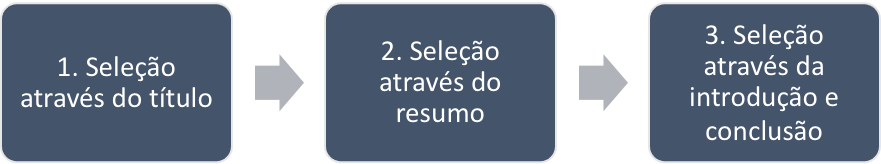

UNIVERSIdade FEEVALE

nome do aluno

título do trabalho

Novo Hamburgo

2019

nome do aluno

título do trabalho

Trabalho de Conclusão de Curso

apresentado como requisito parcial

à obtenção do grau de Bacharel em

Nome do Curso pela

Universidade Feevale

Orientador: nome do professor orientador

Novo Hamburgo

2019

Agradecimentos

Gostaria de agradecer a todos os que, de alguma maneira, contribuíram
para a realização desse trabalho de conclusão, em especial:

Aos amigos e às pessoas que convivem comigo diariamente, minha gratidão,
pelo apoio emocional - nos períodos mais difíceis do trabalho.

Enfim, os demais agradecimentos que o aluno desejar fazer.

\* Folha de dedicatória ou de agradecimentos = elemento opcional. O
texto fica na parte inferior da página, respeitando as margens de 2cm da
borda direita e 8cm da borda esquerda da página (PRODANOV, 2003, p. 42).

Resumo

Esse trabalho apresenta o posicionamento de diversos atores sociais e
grupos de interesse, envolvidos na área da saúde, no Rio Grande do Sul,
em relação aos princípios norteadores do Sistema Único de Saúde (SUS) e
o projeto de política de saúde que defendiam no período inicial do
processo de reforma sanitária e no período de operacionalização e
institucionalização do SUS. Ao comparar essas duas fases de análise,
buscou-se verificar se houve mudança nos posicionamentos e nos projetos
de política de saúde, defendidos pelos atores, procurando examinar as
possíveis razões para que elas tenham ocorrido. Através de estudo
qualitativo, foram realizadas dezoito entrevistas, as quais ocorreram
com representantes dos grupos sociais selecionados para a pesquisa. De
acordo com os seus posicionamentos, em relação à reforma sanitária
brasileira, os diferentes atores sociais e grupos de interesse foram
classificados em dois blocos/posições: os que apoiavam o processo de
reforma sanitária – compondo, assim, a *policy community* reformista - e
os opositores a ela. Em ambos os grupos/blocos, foram identificadas
mudanças nas propostas e posições defendidas, mas as maiores novidades
ocorreram entre os primeiros.

Palavras-chave: Políticas de saúde. Grupos de interesse. Reforma
sanitária brasileira. Sistema Único de Saúde. Projetos de política de
saúde.

\* O resumo em português e em língua estrangeira é elemento obrigatório
=\> não pode ultrapassar, segundo o livro do Prof. Prodanov (2003), 500
palavras. É obrigatório colocar as palavras-chave (no máximo 5). O
resumo é construído em parágrafo único.

Abstract

Tradução do Resumo para a língua inglesa.

Keywords: tradução das palavras-chave para a língua inglesa.

Lista de Figuras

[Figura 1 – Estrutura de desenvolvimento em duas camadas
14](#_Toc515473980)

[Figura 2 – Padrão MVC - separação em camadas 15](#_Toc515473981)

\* As listas (de figuras, de tabelas e de abreviaturas e siglas,) devem
ser apresentadas conforme aparecem no trabalho (na ordem), com cada item
designado pelo seu nome/título específico e do respectivo número da
página. Elaborar uma lista própria para cada tipo. Espaço entre linhas
= 1,5, sem o espaçamento antes e depois
(6ptos).

Lista de Tabelas

[Tabela 1 – Matrícula dos alunos do Centro de Educação da FURG segundo o
município. 15](#_Toc515474000)

Lista de Abreviaturas e Siglas

| BSC     | Balanced Scorecard                                        |
| ------- | --------------------------------------------------------- |
| CAPF    | Custo Anual por Funcionário                               |
| CAPT    | Custo Anual por Teclado                                   |
| CAPU    | Custo Anual por Usuário                                   |
| CEO     | Chief of Executive Office                                 |
| CIA/FVG | Centro de Informática Aplicada da Fundação Getúlio Vargas |
| CIO     | Chief of Information Office                               |
| CO      | Contexto Organizacional                                   |
| COBIT   | Control Objectives for Information and related Technology |
| ERP     | Enterprise Resource Planning                              |
| FCS     | Fatores Críticos de Sucesso                               |
| FGV     | Fundação Getúlio Vargas                                   |
| ISACA   | Information Systems Audit and Control Association         |
| MIT     | Massachusetts Institute of Technology                     |
| PEE     | Planejamento Estratégico Empresarial                      |
| PETI    | Panejamento Estratégico da Tecnologia da Informação       |
| RH      | Recursos Humanos                                          |
| ROE     | Return On Expectation                                     |
| ROI     | Return On Investiment                                     |
| SI      | Sistemas de Informação                                    |
| SLA     | Service Level Agreements                                  |
| SLM     | Service Level Managements                                 |

Sumário

[1 Introdução 11](#introdução)

[2 Capítulo 2 13](#_Toc515474047)

[2.1 Primeiro subtítulo do capítulo 13](#_Toc515474048)

[2.2 Segundo subtítulo do capítulo 14](#_Toc515474049)

[2.2.1 Subtítulo de nível 3 14](#_Toc515474050)

[2.2.2 Outro subtítulo de nível 3 14](#_Toc515474051)

[2.3 Terceiro subtítulo do capítulo 16](#_Toc515474052)

[3 CONCLUSÃO 17](#conclusão)

[Referências Bibliográficas 18](#referências-bibliográficas)

O sumário é elemento obrigatório, em que se apresentam os títulos e
subtítulos (ou seções), seguidos de sua paginação. É recomendável
(PRODANOV, 2003, p.32) que não se ultrapassem cinco níveis de
subtítulos. Deixar um espaço maior para separar cada título =\> por
exemplo, espaçamento antes e depois = 6 pts. Este sumário foi elaborado
automaticamente pelo Word. Para atualizá-lo, basta clicar com o botão
direito, escolher Atualizar Campo e depois Atualizar o Índice Inteiro.

# Introdução

A tecnologia avançou muito nos últimos anos, principalmente quando
aborda-se internet e armazenamento de dados (MURARO, 2009). O custo de
armazenar um arquivo vem ficando mais barato e tem feito com que as
pessoas tenham mais espaço de armazenamento, possibilitando a geração de
mais informações (UNIVERSIDADE FEDERAL DO CEARA, \[s.d.\]). A quantidade
de aplicações disponíveis na internet tem aumentado cada vez mais e
consecutivamente gerando mais dados e opções para os usuários.

Diversas vezes o indivíduo possui dificuldades em realizar escolhas
entre as diversas alternativas daquilo que lhe é apresentado, e acaba
geralmente confiando nas escolhas que lhe são apresentadas através de
outras pessoas (RESNICK, PAUL AND VARIAN, 1997). A partir do aumento da
quantidade de informações disponíveis e do conhecimento da habilidade do
indivíduo de realizar escolhas, a partir de sua experiência pessoal,
surgem os sistemas de recomendação. Esses sistemas buscam filtrar a
grande massa de dados disponível, para auxiliar o indivíduo na escolha
das opções disponíveis.

Sistemas de recomendação (RecSys - *Recommender Systems*) são
implementações de *softwares* e técnicas, que apresentam sugestões de
itens que seriam de uso de um usuário. As sugestões são de acordo com
vários processos de decisão, como, que item comprar, que música escutar
ou que notícia ler. No geral, sistemas de recomendação servem para dois
propósitos diferentes: (i) podem ser utilizados para estimular os
usuários a fazer alguma coisa como comprar livros ou assistir algum
filme ou (ii) os sistemas de recomendação podem ser utilizados para
lidar com a sobrecarga de informações, selecionando os melhores itens de
uma base maior (DIETMAR et al., 2010).

O auxílio que um sistema de recomendação provê pode ser bem específico
ou genérico. Isso vai depender do tipo de filtragem escolhida para
realizar a recomendação. Quando um sistema busca uma filtragem que leva
em consideração as preferências do usuário, elas podem ser obtidas
implicitamente, por meio de um monitoramento de comportamento. No
entanto, um sistema de recomendação pode também obter explicitamente sua
preferência através de perguntas (DIETMAR et al., 2010).

As recomendações personalizadas necessitam que o sistema conheça algo
sobre cada usuário da base. Todo sistema de recomendação deve
desenvolver e manter um *user model* ou *user profile*, que por exemplo,
contém as preferências dele. A existência de um *user model* é essencial
para qualquer sistema de recomendação (DIETMAR et al., 2010).

Os sistemas de recomendação iniciaram com a "Usenet" da Duke University,
na década de 70, um sistema com uma distribuição global que buscava
divulgar novas notícias postadas e classificadas pelos seus usuários. Em
1985, iniciaram-se as recomendações baseadas em conteúdo, a partir de
uma arquitetura para sistemas de informação de larga escala. A Xerox
teve sua grande participação em 1992, desenvolvendo o primeiro sistema
(Tapestry) designado a realizar a filtragem colaborativa. Em 1997, foi
desenvolvido o primeiro sistema de recomendação de filmes chamado
Movielens. Até que em 2000, a Pandora iniciou o projeto genoma musical,
onde a recomendação passou a ser utilizada para facilitar as escolhas de
um usuário entre as diversas músicas existentes na época (BHATNAGAR,
2016).

Desde então, os sistemas de recomendação têm revolucionado o mercado de
aplicações de diversas formas, pois com eles, aumentam-se o número de
itens vendidos em sites de venda online, além dos sites conseguirem
vender itens mais diversificados. Eles têm melhorado a satisfação dos
usuários e, com isso, têm aumentado suas fidelidades na aplicação, e o
principal, os *RecSys* ajudam a entender melhor o que os usuários
querem. (RICCI; ROKACH; SHAPIRA, 2011)

Os *RecSys* têm evoluído muito desde o seu surgimento, isso acontece
dado o interesse acadêmico e comercial sobre a área, além dos benefícios
que ela pode trazer. Um caso famoso dos sistemas de recomendação foi o
Netflix Prize, uma competição feita pela Netflix, que ofereceu um milhão
a quem melhorasse o algoritmo de recomendação de seu sistema em 10%. A
competição iniciou em 2006 e demorou 3 anos para alguém conseguir
resolver o problema deles de maneira satisfatória. Nesse caso o vencedor
utilizou um modelo híbrido de *RecSys* (FALK, 2019).

Dietmar diz que existem 4 tipos de sistemas de recomendação, sendo eles:
recomendação colaborativa, recomendação baseada em conteúdo,
recomendação baseada em conhecimento, e sistemas de recomendação
híbridos (DIETMAR et al., 2010).

Na recomendação baseada em conteúdo, o sistema aprende a recomendar
itens que são similares ao que o usuário gostou no passado, essa
similaridade é calculada com base na relação das características dos
itens a serem comparados. Por exemplo, no caso de usuário avaliar
positivamente um filme do gênero comédia, então, o sistema pode
registrar essa ação e futuramente recomendar outros filmes desse mesmo
gênero. (RICCI; ROKACH; SHAPIRA, 2011)

A recomendação colaborativa parte da ideia de que se os usuários
compartilharam dos mesmos interesses no passado, eles irão continuar
tendo os mesmos interesses no futuro. Por exemplo, os usuários A e B tem
um histórico de compras bem semelhante e o usuário A comprou um novo
livro que o usuário B nem chegou a ver, nesse tipo de recomendação, a
ideia é que o sistema sugira este livro para o usuário B (DIETMAR et
al., 2010).

Diferente da recomendação colaborativa ou baseada em conteúdo, a
recomendação baseada em aprendizado não consegue depender somente do
histórico de compra de um usuário, é necessário um conteúdo mais
estruturado e detalhado para ser gerada uma recomendação, geralmente
nesse tipo, é utilizado um conteúdo adicional fornecido manualmente
(conteúdo recente ao produto e usuário) (DIETMAR et al., 2010).

E por último, e não menos importante, DIETMAR et al. (2010) trazem em
sua obra o modelo híbrido de recomendação, onde a ideia é combinar as
diferentes técnicas, buscando gerar uma boa e mais assertiva
recomendação.

Esses sistemas têm ajudado muito na venda de produtos online. No
entanto, um dos segmentos de mercado que apresentaram problemas, foram
as vendas de álbum ou faixas musicais online. Elas possibilitam às
pessoas baixarem ou receberem as faixas a partir de compras em lojas
virtuais, porém o preço de cada faixa ainda era muito caro, o que fazia
com que muitos usuários optassem pela pirataria. Desta forma, surgiu uma
nova maneira de anunciar os “produtos musicais” online, o *streaming*
musical (BORJA; DIERINGER, 2016).

O mercado musical tem evoluído muito desde seu início. No começo, seu
consumo foi aumentando cada vez mais com a evolução das tecnologias e
internet. Com o *streaming* musical, as pessoas passaram a consumir mais
os sistemas de *streaming*, diminuindo o consumo de pirataria online
(ERIKSSON et al., 2019). Em 2018 o lucro global da indústria musical
cresceu 9,7%. Nesse crescimento, o *streaming* pago possui boa parte
dele com 34% do total (IFPI, 2019).

Os sistemas de *streaming* são um tipo de mecanismo de processamento de
dados projetado com um conjunto de dados infinitos em mente (NIWA,
2018). Esse mecanismo pode ser desenvolvido para processar muitos tipos
de mídia, tais como vídeos, fotos e áudio. Nesse trabalho será utilizado
o *streaming* de áudio, mais especificamente, o *streaming* disponível
nas APIs da ferramenta Spotify.

Dentro dos sistemas de *streaming*, existe o *streaming* de áudio que é
semelhante a transmissão de rádio tradicional, exceto que é utilizada a
internet para enviar e receber os áudios, ao invés de utilizar ondas
aéreas. Assim como o ato de ligar um rádio, o *streaming* de áudio é
reproduzido em tempo real, o que é muito mais conveniente do que baixar
uma música online e então consumi-la (LUINI; WHITMAN; DATE, 2002).

## Objetivo Geral 

Desenvolver um sistema de recomendação musical, considerando o contexto
comportamental do usuário, bem como o contexto do ambiente onde ele
encontra-se.

## Objetivos Específicos

  - Investigar APIs de Serviços de *Streamings* Musicais.

  - Selecionar a API a ser utilizada no sistema de recomendação.

  - Definir os contextos de ambiente a serem utilizados no sistema.

  - Definir os contextos comportamentais do usuário a serem utilizados
    no sistema.

  - Criar a infraestrutura necessária para o armazenamento e
    relacionamento das músicas com os contextos comportamentais e de
    ambiente do usuário.

  - Criar um protótipo do sistema de recomendação.

  - Avaliar o sistema de recomendação com usuários voluntários.

## Metodologia

Esse trabalho tem como natureza a pesquisa aplicada, pois através dos
conhecimentos estudados de *RecSys* foi desenvolvido um sistema que gera
as recomendações musicais personalizadas por usuário, por meio do
contexto comportamental e ambiental, obtido através do *plugin* de
reprodução musical.

O método científico utilizado por esse trabalho é do tipo dedutivo, dado
que primeiro foi realizado uma pesquisa bibliográfica relacionada ao
problema proposto, para então obter a solução. Essa pesquisa buscou
estudar o funcionamento dos sistemas de recomendação musicais, por meio
dos artigos relacionados, fazendo com que ela tenha como objetivo um
estudo exploratório.

Utilizou-se 2 tipos de procedimentos técnicos nessa pesquisa. Pesquisa
bibliográfica, dado que foi necessária uma base de conhecimentos e
estudos sobre os *RecSys*, suas técnicas e algoritmos. Com o estudo
realizado e os registros de contextos definidos, foi utilizado da
pesquisa experimental, para avaliar a base disponível através da
aplicação liberada aos usuários. Para realizá-lo, foi necessário um
estudo de técnicas para avaliar os resultados de um RecSys.

Tendo as técnicas de avaliação a serem utilizadas definidas, elas foram
desenvolvidas no sistema, permitindo que os usuários consigam contribuir
com sua recomendação através do uso. Essa pesquisa, apresentou no final
os resultados estatísticos obtidos pelas recomendações do sistema e suas
avaliações, apresentando, por exemplo, a quantidade de acertos e erros
obtidos nas recomendações, fazendo com que, essa pesquisa tenha uma
abordagem do tipo quantitativa.

Ao final, esse trabalho procurou responder a seguinte questão: Com base
nas músicas conhecidas pelo usuário, é possível aperfeiçoar as
recomendações de um sistema, aplicando os conhecimentos de RecSys e
utilizando dados de contexto comportamental e de ambiente?

Portanto, de acordo com esse contexto, este trabalho construiu um
sistema de recomendação musical, utilizando o contexto comportamental do
usuário e o contexto do ambiente onde ele está inserido. Esse contexto
foi obtido através da criação de um *plugin* que permitirá ao usuário
escutar suas músicas enquanto são registrados os eventos do contexto
vivido naquele momento.

O trabalho está dividido em 3 capítulos. O primeiro capítulo aborda uma
pesquisa bibliográfica, onde é apresentado uma revisão dos sistemas de
recomendação relacionados e os trabalhos resultantes. O capítulo dois
detalha a definição do contexto, questionário enviado aos usuários,
desenvolvimento do plugin e a coleta de dados da aplicação web. O último
capítulo define o algoritmo utilizado, preparação dos dados coletados do
plugin, modelagem do sistema desenvolvido e no fim os resultados obtidos
no experimento.

# Trabalhos relacionados

Os sistemas de recomendação musical iniciaram nos anos 90 e têm evoluído
muito desde então, ao ponto de que hoje existem diversos trabalhos
relacionados a esse assunto para área. Nesse capítulo serão abordados
alguns trabalhos encontrados, a partir de uma revisão bibliográfica
realizada sobre o assunto.

Após ser realizada a revisão bibliográfica, foram analisados os
algoritmos e estratégias de recomendação de cada artigo. E então, será
desenvolvido o sistema de recomendação desse trabalho, utilizando um dos
algoritmos levantados.

## Levantamento bibliográfico inicial

Antes do início da revisão, foram encontrados diversos trabalhos
relacionados através de: (i) busca genérica no Google Scholar; (ii)
indicação dos avaliadores desse trabalho. Destes, foram selecionados 2
para serem revisados nesse trabalho.

Realizada a busca genérica no Google Scholar em busca de trabalhos
relacionados ao tema desse trabalho, foram priorizados os trabalhos em
português, para dar uma visão clara e rápida do assunto. E nessa busca
foi encontrado o seguinte trabalho: “Desenvolvimento de um Sistema de
Recomendação Musical Sensível ao Contexto”. (ALIAGA, 2018)

Esse trabalho teve como objetivo desenvolver o modelo de um sistema
sensível ao contexto, utilizando das técnicas clássicas de
recomendação, aplicando uma camada extra de filtragem colaborativa.
Nessa camada, ele utiliza do algoritmo K-Vizinhos Mais Próximos (KNN)
para realizá-la, o qual é o mais amplamente utilizado para esse tipo de
recomendação conforme (ALIAGA, 2018 apud BOBADILLA et al., 2013, p. 43).

No trabalho de ALIAGA (2018) foram escolhidos 10 usuários para realizar
o teste, tendo um contexto comum que era “Estudar” para atividade e “BR”
para cultura. Foram realizados 240 testes para compilar os dados do
experimento, e no fim foram apresentados os resultados do experimento
realizado “Com contexto” e “Sem contexto”, onde o trabalho obteve uma
precisão de 50% na taxa de aceitação das recomendações realizadas.

As indicações de trabalhos relacionados realizadas pelos avaliadores (na
revisão do anteprojeto) foram analisadas e foi identificado o algoritmo
KNN também no trabalho “Effective Nearest-Neighbor Music
Recommendations”. (LUDEWIG et al., 2018) Esse trabalho apresenta uma
técnica hibrida de recomendação, que utiliza uma combinação do KNN,
fatoração de matriz e um pequeno conjunto heurístico.

## O protocolo de revisão

Essa revisão tem como foco encontrar trabalhos que abordam os sistemas
de recomendação, que a partir das músicas conhecidas pelo usuário, e do
contexto comportamental e de ambiente apresentado, buscam melhorar
assertividade das recomendações ao ouvinte.

Dado o foco da pesquisa e o conteúdo encontrado até o momento, foi feita
uma lista de interesses que serão abordados nessa revisão:

##### Estudos realizados

##### Técnicas de recomendação utilizadas

##### Contextos utilizados para recomendação

A partir do escopo de revisão que esse trabalho está inserido, foram
definidas certas palavras-chaves para auxiliar no desenvolvimento da
revisão, elas são:

  - RecSys

  - Machine Learning

  - Sistemas de recomendação musical

  - *Context-aware* (Cientes de contexto)

Para realizar a busca dos trabalhos relacionados foi utilizado o motor
de busca da ACM\[1\], o qual permite realizar pesquisas avançadas a
partir da linguagem desenvolvida pela ACM e dos filtros disponíveis na
busca (ACM, 2020). Esse motor de busca foi escolhido por conter diversos
trabalhos de excelência na área da computação.

Foi desenvolvida uma *string* de busca para filtrar por estudos que
estejam de acordo com o foco de pesquisa do trabalho. Existem muitos
artigos e diversas áreas de pesquisa relacionadas aos sistemas de
recomendação musical, então, para realizar uma busca mais assertiva, foi
utilizada a seguinte *string* de busca:

((“RecSys” OR “recommender systems”) AND (“machine learning”) AND
(“music” OR “musical”) AND (“behavioral context” OR “environmental
context” OR “context-aware”))

Com os resultados da busca, cada trabalho foi analisado, e esta análise
foi dividida em quatro etapas: (i) a leitura inicial foi feita no título
de cada artigo, e foram mantidos àqueles que indicam uma relação com
essa pesquisa; (ii) consistiu em realizar uma leitura dos resumos desses
trabalhos e manter àqueles adequados; (iii) aplicou-se um filtro,
baseando-se na leitura da introdução e conclusão dos artigos e por fim;
(iv) leitura total dos artigos selecionados.

Após a leitura aprofundada em cima dos artigos selecionados, essa
revisão trouxe informações de cada publicação, onde foi possível
entender o que já foi desenvolvido. Ao final, foi desenvolvida uma
tabela relacionando as funcionalidades existentes e o uso delas nos
trabalhos encontrados, a qual será apresentada nas próximas seções.

## PROCURA NOS MOTORES DE BUSCA

No dia 07/05/2020 foi realizada a pesquisa no motor de busca ACM
utilizando a *string* de busca pré-definida anteriormente. As Figuras 1,
2 e 3 ilustram esse processo. A Figura 1 apresenta a string de busca
desenvolvida no motor da ACM, e as Figuras 2 e 3 apresentam
respectivamente os resultados das buscas por *proceedings* e *journals*.
A quantidade de resultados apresentados na ACM foi de 150 trabalhos.

Figura - Motor avançado de busca da ACM

Fonte: Elaborado pelo autor (2020)

Buscando aumentar o foco da pesquisa, foram aplicados alguns filtros em
cima da busca. Procurando trazer somente os trabalhos mais atuais
relacionados à área, foram mantidos somente os artigos publicados nos
últimos 5 anos (2015-2020).

Figura **2** - Resultado de busca dos *proceedings* no motor de busca da
ACM

Fonte: Elaborado pelo autor (2020)

Visando trazer um conteúdo mais técnico para o trabalho, foram reduzidos
os tipos de publicações aceitas para *proceedings* e *journals*. Após
aplicados esses filtros, a quantidade de trabalhos encontrados passou
para 83.

Figura **3** - Resultado de busca dos *journals* no motor de busca da
ACM

Fonte: Elaborado pelo autor (2020)

Um dos principais motivos que levou essa revisão ser realizada através
da ACM, ao invés de outras plataformas de busca como IEEE, é que ela
concentra diversas conferências e eventos relacionados a área de RecSys
(ACM RECSYS COMMUNITY, 2020).

## ETAPAS DA REVISÃO DOS TRABALHOS

Com a busca realizada no dia 07/05/20, no motor da ACM, a partir da
*string* de busca foram encontrados 83 trabalhos, sendo 23 do tipo
*journal* e 60 do tipo *proceeding*. Em cima deles, foi realizado um
filtro baseado em 3 etapas (demonstradas na Figura 4), que visam
direcionar esta pesquisa para a revisão dos trabalhos que condizem com o
objetivo descrito no protocolo.

Figura - Etapas realizadas para filtrar os trabalhos encontrados no
motor de busca da ACM

Fonte: Elaborado pelo autor (2020)

Baseado no conhecimento obtido dos trabalhos na segunda etapa, foi
realizada uma classificação deles em 4 tipos, que são: (i) trabalhos que
possuem relação com o foco de pesquisa da revisão; (ii) trabalhos que
utilizam dos RecSys e contexto, mas que visam recomendar outros temas
além da música como notícias, filmes e, produtos; (iii) trabalhos que
utilizam dos RecSys e contexto, mas que não abordam a recomendação
musical; (iv) trabalhos que utilizam dos RecSys musicais, mas que não
utilizam o contexto nas recomendações. A Figura 5 apresenta a relação
entre os tipos e a quantidade de artigos encontrados.

Figura - Filtro em cima dos trabalhos selecionados através do resumo

Fonte: Elaborado pelo autor (2020)

### Trabalhos selecionados

O resultado do procedimento de filtro apresentado na Figura 6, resultou
em 4 trabalhos relacionados ao objetivo descrito no protocolo de revisão
desse trabalho.

Figura - Procedimento de filtro realizado baseado nos trabalhos
encontrados no motor de busca da ACM

Fonte: Elaborado pelo autor (2020)

Foi realizada uma revisão nesses trabalhos, a qual foi apresentada nas
próximas seções. Em cada seção/artigo, foi apresentado um breve resumo
do que foi desenvolvido e no fim, foram respondidas as seguintes
perguntas:

##### Qual o problema que ele resolveu?

  - Buscam obter uma recomendação personalizada pelo gosto do usuário?

##### Quais técnicas foram usadas?

  - Foi utilizada alguma recomendação colaborativa?

  - Quais foram os algoritmos utilizados na recomendação?

##### Qual a base de treinamento e teste?

  - Foi desenvolvida alguma aplicação para obter as bases?

##### Quais os contextos utilizados?

  - Foi analisado o comportamento? Quais aspectos?

  - Foi analisado o ambiente? Quais fatores?

##### Como é obtido o contexto?

  - O usuário pode auxiliar na definição do contexto?

  - É apresentado o contexto atual para o usuário?

##### A recomendação atingiu as expectativas do usuário?

  - Quais foram os critérios de qualidade utilizados?

  - Quantidade de usuários utilizada? (tamanho da base)

  - Quais foram as técnicas de avaliação usadas?

#### The New Challenges when Modeling Context through Diversity over Time in Recommender Systems (L’HUILLIER, 2016)

Foi realizada a revisão do trabalho e verificado que ele não apresenta
dados e técnicas suficientes para serem consideradas nessa pesquisa,
pois todas as informações do sistema desenvolvido estão em outros
artigos citados por esse. Dada a falta de informações apresentadas nesse
trabalho, não serão respondidas as questões pré-estabelecidas
anteriormente.

#### Prediction of music pairwise preferences from facial expressions (TKALČIČ et al., 2019)

Essa pesquisa apresenta técnicas de como obter as preferências de um
usuário através de suas expressões faciais. Para isso, foi desenvolvida
uma aplicação onde a preferência do usuário é obtida através da
observação do seu comportamento. Cada usuário devia ouvir ao menos 10
segundos de cada uma das duas músicas apresentadas na tela e ao
finalizar, poderia escolher qual música era mais adequada para se ouvir
no ambiente pré-estabelecido que era seu trabalho. É nesse momento que
são obtidos os dois contextos estudados no artigo revisado, que são:
(i) as expressões faciais gravadas através de uma câmera; (ii) o tempo
dedicado a ouvir cada música.

##### Qual o problema que ele resolveu?

Nesse trabalho é apresentada uma abordagem para predizer a preferência
musical do usuário a partir das expressões faciais. Ela busca responder
a seguinte questão: É possível inferir (implicitamente), em pares, as
preferências musicais de um usuário, a partir de suas expressões faciais
demonstradas, enquanto escuta suas músicas?

##### Quais técnicas foram usadas?

A principal técnica utilizada para predição das músicas foi a de gerar
um *score,* a partir da comparação par a par em cima das escolhas do
usuário, nas opções de músicas apresentadas. Essa comparação foi
realizada como: (i) um problema de regressão, onde eles predizem a
pontuação numérica em pares; (ii) um problema de classificação, onde foi
predito uma pontuação em pares como classe discreta alternativa (o
usuário preferiu a da esquerda, direita ou ambas).

A recomendação gerada foi personalizada por usuário e não foi utilizado
o modo colaborativo, mas foi demonstrado o interesse nos trabalhos
futuros em adicionar ao RecSys esse modelo.

Para realizar a predição da música desejada, dada a expressão facial,
foram experimentados diversos algoritmos, e no fim, foram utilizados os
algoritmos *Random Forest* e *Gradient Boosting* por apresentarem os
melhores resultados. Eles os escolheram, dado a principal base de
predição, que foi, o uso do tempo em que os usuários escutaram as
músicas e a diferença da duração entre duas músicas em par.

Para auxiliar no *score* em par, foi utilizado o *Spearman’s Rank
Correlation Coefficient* entre as diferentes durações (distribuições não
normais). Isso é, quanto maior a diferença entre as duas músicas, maior
a probabilidade de o usuário ter gostado da música que ele escutou por
mais tempo. Para obter os resultados, foi realizada a comparação da
precisão das preferências de predição dos modelos bases, utilizando
*Root Mean Squared Error* (RMSE), precisão, *recall*, *F-measure* e
acuracidade.

##### Qual a base de treinamento e teste?

A base dessa pesquisa foi gerada através do uso em um ambiente
controlado de uma aplicação desenvolvida. Foi utilizado um total de 75
usuários para utilizar a aplicação, com uma média de idade de 29,8 anos.

##### Quais os contextos utilizados?

O principal contexto utilizado nesse trabalho foi relacionado às emoções
dos usuários, obtidas através das expressões faciais dos usuários
gravadas durante os testes realizados. No fim, foi apresentado um outro
contexto comportamental, que é o tempo em que os usuários escutaram cada
música. Não foi apresentado nenhum tipo de contexto de ambiente.

##### Como é obtido o contexto?

Os dois contextos são obtidos enquanto o usuário está utilizando a
aplicação de teste para reproduzir músicas. As emoções são obtidas a
partir das expressões faciais produzidas, e o tempo que é gravado
enquanto ele escuta cada música. Não é apresentado o contexto atual ao
usuário, e não existe um formulário onde o usuário possa definir
explicitamente o contexto.

A preferência do usuário foi obtida através da observação do seu
comportamento em cima da aplicação. Cada usuário devia ouvir ao menos 10
segundos de cada uma das duas músicas apresentadas e ao finalizar,
poderia escolher qual música era mais adequada para se ouvir no ambiente
pré-estabelecido que era o seu trabalho.

##### A recomendação atingiu as expectativas do usuário?

Para obter os resultados, foi realizada a comparação da precisão das
preferências de predição dos modelos, utilizando *Root Mean Squared
Error* (RMSE), precisão, *recall*, *F-measure* e acuracidade. A
precisão, *recall* e *F-measure* foram calculadas, ponderando os
*scores* de cada classe pelo número de instâncias verdadeiras de cada.

Para validar a qualidade da recomendação proposta, foi utilizado o tempo
em que o usuário escutou cada música, pois, quanto maior a diferença
entre as duas músicas, maior a probabilidade de o usuário ter gostado da
música que ele ouviu por mais tempo. Outro critério apresentado foi a
sua avaliação das músicas em par.

#### Towards Intent-Aware Contextual Music Recommendation: Initial Experiments (VOLOKHIN; AGICHTEIN, 2018)

O artigo apresenta técnicas e resultados que buscam estudar as intenções
dos usuários ao buscar uma música para escutar, as quais são obtidas
através do título e descrição das *playlists* reproduzidas. Para
demonstrar as técnicas, foi realizado um estudo em cima da API do
Spotify e Youtube. A partir desse estudo, são geradas *playlists*
especificas para cada atividade relacionada às intenções dos usuários. E
no fim é realizada uma avaliação comparativa dela com a gerada pelo
método do Spotify (SPTF).

Para gerar as *playlists*, foi desenvolvido um método de recomendação
chamado *Activity-aware Intent Recommendation* (AIR), que usa a API do
Spotify para obter suas melhores *playlist* relacionadas à busca, delas
são obtidas as *top* 10 músicas com melhores *scores*, as quais são
incluídas nas recomendações futuras para cada atividade (Dirigir,
Trabalhar, Cozinhar, ...).

#####  Qual o problema que ele resolveu?

São abordadas 3 contribuições no artigo: (i) é estimada uma distribuição
empírica das intenções do ouvinte ao reproduzir um vídeo no Youtube;
(ii) é realizado um experimento semelhante ao da primeira contribuição,
porém utilizando o Spotify; (iii) são relatados os resultados iniciais
obtidos, utilizando o modelo de intenções treinados para melhorar as
recomendações. O modelo apresentado demonstra melhorias promissoras na
recomendação de músicas através das intenções do usuário, ao invés de
recomendações que dependem apenas de suas atividades.

##### Quais técnicas foram usadas?

Dado o escopo desse trabalho, serão apresentadas somente as técnicas
utilizadas nas recomendações de áudio. O artigo apresenta a
especificação de um algoritmo que busca entender as intenções do
usuário através dos títulos das *playlists,* disponibilizadas por ele.
A pesquisa não utilizou da recomendação colaborativa.

As intenções foram obtidas através de diversos tipos de algoritmos de
*machine learning* como: *Logistic Regression*, *Both Fuzzy* e *Hard
Clustering*, mas os melhores resultados foram obtidos utilizando o
*Random Forest Classifier* (utilizando a implementação do *sklearn*).
Não foram apresentados os algoritmos utilizados para realizar a
recomendação musical.

##### Qual a base de treinamento e teste?

A base de intenções é montada a partir de testes realizados utilizando a
API do Spotify em Python, em cima das *playlists* dispostas do usuário.
Não é apresentada nenhuma aplicação desenvolvida para obter as bases.

##### Quais os contextos utilizados?

Esse trabalho não busca entender o contexto em si. Ele apenas busca
entender uma de suas características, que são as intenções do usuário,
ao procurar por uma *playlist* e, a partir das intenções obtidas,
procura gerar *playlists* relacionadas às atividades que o usuário está
executando. O principal atributo utilizado para predizer suas intenções
é a descrição da *playlist* encontrada em sua busca.

##### Como é obtido o contexto?

Para obter o comportamento do usuário foram avaliadas, durante um
período de teste, as intenções dos usuários nas buscas por *playlists*
e, a partir delas, foi gerada uma *playlist* de acordo com suas
intenções. Esse comportamento é obtido de maneira implícita e o
usuário não pode ajudar na definição do contexto. Não é apresentado ao
usuário o contexto atual obtido através do seu comportamento.

##### A recomendação atingiu as expectativas do usuário?

Para validar as recomendações do sistema, foi realizada uma comparação
com o RecSys do Spotify (SPTF) e o criado no artigo revisado (AIR).
Nessa comparação foi pedido ao usuário para avaliar as duas *playlists*
geradas pelos sistemas. As *playlists* geradas automaticamente para cada
uma das 10 atividades foram agrupadas. Depois foram avaliadas por 1-3
avaliadores humanos. A avaliação tem como objetivo validar o quanto a
*playlist* se enquadrava na atividade estipulada.

A partir das avaliações realizadas, foram utilizadas 3 métricas para
estimar a qualidade das recomendações feitas a partir dos coeficientes
de correlação, elas são: (i) coeficiente de correlação de Kendallτ; (ii)
τ-AP para calcular a relevância das recomendações; (iii) uma variação do
*Mean Reciprocal Rank* (nMMR). Essas métricas são importantes para
avaliar numericamente a qualidade de cada *playlist* recomendada. Não é
apresentado o tamanho da base utilizada nesse artigo.

#### Quantitative Study of Music Listening Behavior in a Smartphone Context (YANG; TENG, 2015)

O artigo revisado apresentou diversos resultados quantitativos, que
foram obtidos através da classificação e computação dos dados de um
aplicativo, o qual foi desenvolvido para reproduzir músicas e registrar
o contexto de um usuário. Ele tem como principal objetivo responder as
seguintes questões:

1.  Em que medida podemos prever a música que um usuário prefere ouvir
    em diferentes contextos de atividade (ou seja, uso de música) da
    vida real?

2.  Em que medida podemos prever a atividade de um usuário a partir dos
    dados do sensor coletados dos *smartphones*, em um contexto de um
    ouvinte musical da vida real?

3.  Como fatores pessoais (dados demográficos, histórico musical,
    preferência musical de longo prazo e traços de personalidade) se
    correlacionam com a previsibilidade do uso de músicas e da atividade
    do usuário para diferentes usuários?

Cada pergunta investiga relações entre os fatores musicais, pessoais e
situacionais da escuta musical. Especificamente é considerado um
conjunto fechado de 8 tipos de atividades, atividades estas relacionadas
a dados diários obtidos pelos 48 usuários durante um período de 3
semanas. O artigo não apresentou ou desenvolveu sistema de recomendação
musical, porém, trouxe diversas informações pertinentes a esse trabalho.

#####  Qual o problema que ele resolveu?

Neste trabalho serão apresentadas diversas técnicas que buscam melhorar
a recomendação personalizada, a partir de diversos dados obtidos por
meio de sensores (implicitamente), ou através de perguntas realizadas ao
usuário.

##### Quais técnicas foram usadas?

Essa seção está dividida nas 3 questões que o artigo revisado busca
resolver. Em nenhuma das questões é abordada a filtragem colaborativa.

##### Em que medida podemos prever a música que um usuário prefere ouvir em diferentes contextos de atividade (ou seja, uso de música) da vida real?

Essa seção do trabalho teve como principal objetivo classificar
(utilizando *auto-tagging*) a relação das preferências musicais x
contextos dos usuários. Antes de iniciar essa classificação, foi
realizado um filtro na base gerada pelos usuários e aplicando certos
critérios de qualidade sobraram 19 dos 48 usuários participantes do
teste.

Baseado nos 19 usuários restantes, foi realizada a criação das *tags* do
teste, que foram divididas em 2 esquemas de aprendizados: o
personalizado e o geral. Os algoritmos considerados para essa
classificação foram o linear e não linear, da *radial basis function*
(RBF) e *support vector machine* (SVM). Dado os problemas com dados
negativos nas classificações binárias, foi utilizada a técnica
*EasyEnsemble* (mais especificamente a *Beta weights*) para neutralizar
os dados.

Por fim, para medir a precisão das *tags* criadas, foi utilizado o
*operating characteristic curve* (AUC), mais especificamente o
*Pearson’s linear correlation coefficient*. Buscando auxiliar a
visualização da valência-excitação das emoções no espaço, foi utilizada
a técnica de *Affective Norm for English Words* (ANEW). E no fim, para
computar a associação entre as músicas e as emoções, foi feito uso do
GPR (*Gaussian Process Regression*), mais especificamente o método
*isotropic rational quadratic covariance kernel* implementado pelo
*toolkit* *Gaussian Process for Machine Learning* (GPML).

Como a experiência da música é multidimensional, o artigo revisado busca
extrair os atributos das músicas, e visa auxiliar o processo de
classificação. Para isso, foram utilizados o *MIRtoolbox* e o *PsySound
toolbox,* os quais conseguem extrair os atributos musicais.

##### Em que medida podemos prever a atividade de um usuário a partir dos dados do sensor coletados dos *smartphones* em um contexto de um ouvinte musical da vida real?

O principal objetivo dessa seção do trabalho foi classificar as
atividades dos usuários (*user-activity*) e relacionar às 8 atividades
definidas com os dados obtidos dos sensores. Foram considerados os
mesmos 19 usuários obtidos na filtragem apresentada na seção anterior.

A partir do aplicativo desenvolvido, foi possível obter os dados dos
sensores utilizando o *Funf Open Sensing Framework*, e semelhante a
classificação dos dados musicais com o contexto, para classificar as
atividades dos usuários com os sensores foram utilizadas as técnicas de
RBF e SVM.

##### Como fatores pessoais se correlacionam com a previsibilidade do uso de músicas e da atividade do usuário para diferentes usuários?

Com os resultados obtidos nas seções anteriores, essa seção busca
determinar quais fatores do usuário são fortes indicadores de desempenho
das duas tarefas. Foram considerados os mesmos 19 usuários obtidos na
filtragem apresentada na seção anterior.

Antes dos usuários passarem a utilizar o sistema, foram realizadas
algumas perguntas a eles, validando e obtendo informações prévias deles.
Nessa seção foi utilizado o *Pearson’s linear correlation coefficient* e
AUC para determinar quais fatores dos usuários são indicadores de
desempenho das duas tarefas.

##### Qual a base de treinamento e teste?

A partir do aplicativo desenvolvido, foram geradas uma base de
treinamento e teste. Elas foram divididas em 3 partes, sendo elas: (i)
relação música x contexto; (ii) relação dos sensores x atividades; (iii)
e por último, os fatores extraídos dos usuários.

##### Quais os contextos utilizados?

O trabalho revisado utiliza dos contextos comportamentais e de ambiente,
e classificaram os fatores de uma preferência musical em 3 tipos
(usuário, música e contexto). Eles são apresentados na Figura 7 abaixo.

Figura - Fatores da preferência musical

Fonte: Elaborado pelo autor (2020)

##### Como é obtido o contexto?

O contexto é obtido a partir do aplicativo desenvolvido, ele trouxe
diversas informações sobre o dia a dia dos usuários, essas informações
foram obtidas através de sensores e formulários que o usuário conseguia
responder. Não é apresentado o contexto atual para o usuário.

##### A recomendação atingiu as expectativas do usuário?

O artigo revisado não desenvolveu um sistema de recomendação, apenas
disponibilizou diversos dados estatísticos que auxiliariam o
desenvolvimento de um *RecSys*. Por isso, não foi definido nenhum
critério de qualidade ou técnicas de avaliação das recomendações. A
base foi obtida através do aplicativo desenvolvido nesse trabalho, ela
continha 48 usuários, que a partir de uma filtragem dos dados efetuada,
passou para 19 nas respostas das questões.

## FUNCIONALIDADES DOS TRABALHOS INVESTIGADOS

O Quadro 1 apresenta a relação das funcionalidades dos 5 artigos
revisados (2 indicados pelos avaliadores e 3 resultantes da revisão
bibliográfica) e da proposta deste trabalho, focando em comparar apenas
as funcionalidades utilizadas no desenvolvimento do sistema de
recomendação. O Quadro 1 apresenta a seguinte legenda de símbolos: ✔
caso possua, ❌ caso não possua.

Quadro - Relação das funcionalidades desenvolvidas em cada artigo
revisado

|                                                                           | (TKALČIČ et al., 2019) | (VOLOKHIN; AGICHTEIN, 2018) | (YANG; TENG, 2015) | (ALIAGA, 2018) | (LUDEWIG et al., 2018) | Proposta deste trabalho |
| ------------------------------------------------------------------------- | ---------------------- | --------------------------- | ------------------ | -------------- | ---------------------- | ----------------------- |
| Tem foco no entendimento do contexto para recomendações musicais?         | ✔                      | ✔                           | ❌                  | ✔              | ❌                      | ✔                       |
| O trabalho foi/será validado em um caso real?                             | ❌                      | ❌                           | ✔                  | ✔              | ✔                      | ✔                       |
| Utiliza do contexto comportamental?                                       | ✔                      | ✔                           | ✔                  | ✔              | ❌                      | ✔                       |
| Utiliza do contexto de ambiente?                                          | ❌                      | ❌                           | ✔                  | ✔              | ❌                      | ✔                       |
| Utiliza do contexto explicito?                                            | ❌                      | ❌                           | ✔                  | ✔              | ❌                      | ✔                       |
| Utiliza do contexto implícito?                                            | ✔                      | ✔                           | ✔                  | ✔              | ❌                      | ✔                       |
| Utiliza do algoritmo *K-Nearest Neighbors* (*KNN*) para classificação?    | ❌                      | ❌                           | ❌                  | ✔              | ✔                      | ✔                       |
| Utiliza do algoritmo *Support Vector Machine* (*SVM*) para classificação? | ❌                      | ✔                           | ✔                  | ❌              | ❌                      | ❌                       |
| Utiliza do algoritmo *Radial Basis Function* (*RBF*) para classificação?  | ❌                      | ❌                           | ✔                  | ❌              | ❌                      | ❌                       |
| Utiliza o algoritmo *Random Forest* para classificação*?*                 | ✔                      | ❌                           | ❌                  | ❌              | ❌                      | ❌                       |
| Utiliza o algoritmo *Gradient Boosting* para classificação*?*             | ✔                      | ❌                           | ❌                  | ❌              | ❌                      | ❌                       |

Fonte: Elaborado pelo autor (2020)

A definição dos algoritmos apresentados no Quadro 1, na coluna da
proposta desse trabalho, foi atualizada a partir das conclusões
apresentadas na capitulo 2.6. Onde é apresentado o algoritmo de
classificação e o motivo da escolha.

## Conclusões dos trabalhos revisados

Após a revisão dos 5 trabalhos estudados em relação a proposta deste
trabalho, foi identificado que nenhum deles apresentou o algoritmo
utilizado na recomendação. Foram apresentados algoritmos de
classificação (*KNN, SVM*, *Random Forest, etc.*), métricas de
avaliação de resultados (*AUC*, *Root Mean Squared Error, Mean
Reciprocal Rank*, etc.), porém em nenhum momento foram apresentados os
algoritmos de recomendação como *Matrix Factorization* (*SVD*,
*Neighborhood* *SVD*, *Deep-Learning MF*, etc.) ou algoritmos de *Tensor
Factorization* (*Tensor Decomposition*, *Nonnegative Tensor
Factorization*, etc.), os quais são os algoritmos utilizados para
realizar a recomendações nos *RecSys*.

Os algoritmos escolhidos para realizar a classificação foram os mais
utilizados nos trabalhos, o KNN e SVM, os quais apareceram em 2 artigos.
Porém o uso do SVM foi descartado, devido ao seu algoritmo tradicional
estar mais voltado para a classificação de classes binárias (RÄTSCH,
2004). Portanto, nesse trabalho escolheu-se usar o algoritmo KNN.

# COLETA DO CONTEXTO DOS USUáRIOS

A partir da revisão bibliográfica realizada, foi possível conhecer
alguns sistemas e modelos que utilizam do contexto para realizar as
recomendações musicais, tornando realizável entender certas lacunas que
não foram analisadas nessa área de pesquisa e, no fim, desenvolvendo um
sistema de recomendação chamado LORS (Loewe’s Recommender System).

Figura - Etapas do desenvolvimento do sistema de recomendação musical

Fonte: Elaborado pelo autor (2020)

LORS utiliza de uma análise recorrente do contexto, para realizar as
recomendações. Esse modelo será apresentado com mais detalhes nas seções
a seguir. Suas etapas de desenvolvimento são apresentadas na **Figura
8**.

## Contexto

Conforme o dicionário Michaelis (EDITORA MELHORAMENTOS LTDA, 2020),
contexto pode ser definido por:

> O conjunto de circunstâncias inter-relacionadas de cuja tessitura se
> depreende determinado fato ou situação; circunstância(s), conjuntura,
> situação.

Um sistema de recomendação busca encontrar os melhores itens para um
devido fim, geralmente, baseado em dados históricos para a produzir.
(DIETMAR et al., 2010) Observa-se que, com o entendimento do contexto,
ou conforme a definição das “circunstâncias que levaram a certos fatos
ou situações”, auxiliar as recomendações, aumentando o número de dados
disponíveis para realizar uma classificação e/ou filtro, já não é mais
um problema. A Figura 8 apresenta uma visão macro dos contextos que
serão considerados no projeto.

Figura - Apresentação dos contextos estudados no trabalho

Fonte: Elaborado pelo autor (2020)

### O que é o contexto comportamental?

Conforme o dicionário Michaelis (EDITORA MELHORAMENTOS LTDA, 2020),
comportamento pode ser tido por:

> Qualquer ação ou reação do organismo ou parte dele.

A partir da definição de contexto, surgiu um levantamento das possíveis
ações a serem registradas em um sistema baseado no *app* Spotify, a fim
de as colocar no questionário. Esse estudo trouxe a seguinte lista de
ações:

  - Passar / Voltar
    
    músicas

  - Escolher músicas preferidas

  - Definir a atividade

  - Definir o humor

### O que é o contexto de ambiente?

Conforme o dicionário Michaelis (EDITORA MELHORAMENTOS LTDA, 2020),
ambiente pode ser tido por:

> Conjunto de condições físicas, biológicas e químicas que rodeiam os
> seres vivos e as coisas.

Pela citação acima, sucedeu-se pesquisas de sensores e informações que
pudessem representar essas condições. A partir da análise dos contextos
levantados, a análise expôs três possíveis contextos de ambiente a ser
representados na aplicação, determinados por: (i) Localização; (ii)
Clima e; (iii) Reprodução musical em grupo / individual. Com finalidade
de explicitar o produto, o protótipo explorará apenas o serviço de
localização.

### Como serão obtidos os contextos?

Obter-se-á os contextos no *LORS* a partir da captura de formulários e
eventos de um *webapp*, aplicados, por conjuntura, de duas maneiras: (i)
explicitamente, para o usuário cadastrar o que está fazendo. Ex.:
emoções, atividades e localização. (ii) implicitamente, adquirido
através das ações do usuário realizadas no aplicativo como os
componentes do *webapp*. Ex.: botão passar de música.

São poucas as ações que auxiliam no entendimento do contexto e que podem
ser obtidas implicitamente, isso devido às limitações dos sensores e
dados disponíveis na aplicação desenvolvida. Por isso, o sistema deste
trabalho contará com informações dispostas de maneira explícita e
implícita, sendo elas:

##### Informações adquiridas de maneira implícita: 

  - localização

  - ações sobre os componentes do *webapp*

  - tempo

  - músicas preferidas

##### Informações adquiridas de maneira explícita: 

  - localização

  - humor

  - atividade

  - músicas preferidas

Os dados de localização implícitos são os de latitude e longitude do
usuário; eles foram salvos na aplicação - devido ao tempo limitado para
o desenvolvimento, o dado não foi utilizado. Logo, o tempo implícito é a
data e hora do evento, registrado para, no futuro, poder ser aplicado um
modelo sequencial junto ao KNN.

### O que são as ações do usuário?

As ações do usuário trazem diversas informações referentes ao que ele
está vivendo (auxiliando o entendimento do seu ambiente e a validação da
acuracidade das recomendações feitas, por exemplo). São elas que
demonstrarão ao sistema, através das músicas recomendadas, o gosto do
usuário, se são de um determinado estilo musical ou de outro. Cada ação
terá um nível de importância, a qual será obtida pelas respostas do
questionário. As possíveis ações a serem executadas pelo usuário estão
listadas na seção 3.1.1.

## Pesquisa com usuários sobre recomendação musical (QUESTIONÁRIO)

Criou-se um questionário com perguntas expostas que permitiram conhecer
melhor os usuários que utilizarão a aplicação. Sendo assim, todas as
questões permitem entender suas preferências, atividades, dentre outros
fatores. As perguntas do questionário estão listadas no Quadro 2:

Quadro - Perguntas e respostas disponibilizadas a um certo público
através dos formulários do Google.

| Pergunta                                                                                     | Possíveis respostas                                                                                                                                                                                                                                                       |
| -------------------------------------------------------------------------------------------- | ------------------------------------------------------------------------------------------------------------------------------------------------------------------------------------------------------------------------------------------------------------------------- |
| 1\. Qual o aplicativo / reprodutor de música você utiliza atualmente?                        | Spotify, Deezer, Youtube Music, TIDAL, Apple Music, Google Play Music, Rádio Outro, qual?                                                                                                                                                                                 |
| 2\. Você acha que as recomendações musicais realizadas via software poderiam ser melhoradas? | Sim, não                                                                                                                                                                                                                                                                  |
| 3\. Você acredita que o contexto poderia melhorar essas recomendações?                       | Sim, não                                                                                                                                                                                                                                                                  |
| 4\. Em quais atividades você costuma ouvir música?                                           | Acordando, Assistindo a filmes / séries / novelas, Comendo, Correndo, Dirigindo, Estudando, Jogando, Lazer, Lendo, Indo dormir, Passeando, Praticando exercícios, Trabalhando, Treinando, Outro, qual?                                                                    |
| 5\. Em quais lugares você costuma ouvir músicas?                                             | Academia, Bar, Biblioteca, Casa, Com os amigos, Escola, Festa, Praia, Restaurante, Trabalho, Outro, qual?                                                                                                                                                                 |
| 6\. Você costuma ouvir música quando está:                                                   | Aborrecido, Alegre, Amoroso, Ansioso, Apavorado, Assustado, Constrangido, Culpado, Deprimido, Desapontado, Excitado, Envergonhado, Em pânico, Feliz, Frustrado, Furioso, Inseguro, Irado, Irritado, Humilhado, Magoado, Nervoso, Orgulhoso, Triste, Zangado, Outro, qual? |
| 7\. O que costuma te influenciar na escolha da música?                                       | Atividades, Clima, Grupo / Individual, Horário do dia, Humor, Localização, Outro, Qual?                                                                                                                                                                                   |
| 8\. O que você faz quando gosta ou não de uma música?                                        | Abrir / Fechar o app, Aumentar / Abaixar volume, Definir tempo da música, Escolher música / artista / gênero, Pausar / Tocar música, Passar / Voltar n músicas, Outra, qual?                                                                                              |
| 9\. As músicas que você escuta sozinho são diferentes das que escuta com os amigos?          | Sim, não                                                                                                                                                                                                                                                                  |
| 10\. Quanto tempo por semana você escuta música?                                             | Menos que 5 horas, de 5 a 10 horas, de 11 a 30 horas, de 31 a 50 horas, mais que 50 horas                                                                                                                                                                                 |
| 11\. Quais são os gêneros musicais que gosta de escutar?                                     | Alternativa, Blues, Clássica, Country, Dance, Eletrônica, Folk, Funk, Hip Hop, Latina, MPB, Jazz, Pop, Reggae, R\&B, Rock, Soundtrack, Vocal                                                                                                                              |
| 12\. Gostaria de participar de uma pesquisa que visa melhorar a recomendação musical?        | Sim, não                                                                                                                                                                                                                                                                  |
| 13\. Sua idade                                                                               |                                                                                                                                                                                                                                                                           |
| 14\. Dicas e sugestões?                                                                      |                                                                                                                                                                                                                                                                           |

Fonte: Elaborado pelo autor (2020)

### Pré-teste do questionário

Com as perguntas do questionário definidas, deu-se o início de uma
validação para garantir que elas fizessem sentido. O pré-teste foi feito
enviando as indagações para 5 pessoas, responsáveis por analisar as
inquirições e avaliar a dificuldade de entendimento de cada uma delas. O
intuito é garantir que o público que recebesse o questionário
posteriormente - o qual não está dentro do contexto do trabalho - também
conseguisse responder as perguntas com a completa compreensão delas. As
melhorias levantadas foram referentes a utilizar uma linguagem mais
simples nas perguntas e respostas, explicar o que é contexto e melhorar
a descrição do questionário.

### Resultados do questionário

Com um alcance maior do que 1000 pessoas, sendo 800 funcionários da CWI,
que possuem acesso ao Slack, 200 pessoas alcançadas através do Instagram
e demais divulgações que tiveram, o questionário teve uma adesão de 222
respostas. O público respondente tinha entre 14 e 71 anos e um gosto
musical bem diversificado, foram obtidos em torno de 60 estilos
musicais, sendo o mais votado o Rock, com 181 marcações.

O questionário foi aberto no dia 6 de julho de 2020, no mesmo dia que,
publicado no Instagram, fora demonstrado ao público. No decorrer de duas
semanas, outras redes sociais participaram da pesquisa, como WhatsApp,
Slack (empresarial), Twitter e Facebook. O seu fechamento aconteceu no
dia 18 de julho de 2020, somando o total de 12 dias em que o ele ficou
aberto.\[2\]

Dos dispositivos (ou aplicativos) utilizados para realizar a reprodução
das músicas, com 168 respostas, o Spotify foi o mais escolhido das
opções. Em segundo lugar ficou o Youtube com 103 respostas (variadas
entre 86 no Youtube Music, e 17 tratando sobre o Youtube clássico).

A pergunta “Você acha que as recomendações musicais realizadas via
software poderiam ser melhoradas?” trouxe uma visão clara sobre o espaço
para esse trabalho evoluir nas técnicas de recomendação musical.
Enquanto aquela que dizia “Você acredita que o contexto poderia melhorar
essas recomendações?” mostrou se havia lugar nesse contexto do usuário
para evoluir tais técnicas. Com 95% para a primeira e 96% para a segunda
pergunta de respostas marcadas como “sim”, foi possível verificar que
esse trabalho pode agregar qualidade às recomendações musicais, segundo
a opinião dos respondentes.

Para aperfeiçoar a visão do trabalho das características de maior
importância, usou-se três indagações, que são: “Em quais atividades
você costuma ouvir música?”, “Em quais lugares você costuma ouvir
músicas?” e “Você costuma ouvir música quando está:”. Com elas,
apareceram novas características (a partir do campo “outro”), como
“Tomando banho”, obteve-se características que mais influenciam os
usuários na escolha de uma música, como “Trabalhando”, a atividade mais
votada com 74%.

Visando entender o comportamento do público, as questões “O que costuma
te influenciar na escolha da música?” e “O que você faz quando gosta ou
não de uma música?” foram importantíssimas. Dessa maneira, não há tanta
dificuldade em compreender as características mais importantes a serem
consideradas no modelo e ordem da aplicação, isso é, Humor e Atividades,
as quais estão presentes no questionário do *plugin*.

A pergunta “As músicas que você escuta sozinho são diferentes das que
escuta com os amigos?” foi desenvolvida para realizar uma avaliação se a
*feature* “amigos ou sozinho” seria desenvolvida. Devido ao tempo
disponível para desenvolvimento, ela acabou não sendo utilizada.

Para obter um conhecimento da intensidade musical do público que lidamos
relacionada ao tempo (estritamente necessário), compôs-se de “Quanto
tempo por semana você escuta música?”. Deu para entender que não era um
público intenso; nas respostas, mais de 50% ouvia de 0 a 10horas por
semana.

Um Cold Start\[3\] precisaria ser construído na aplicação. Então, “Quais
são os gêneros musicais que gosta de escutar?” seria a melhor opção,
caso o objetivo seja colocar as principais respostas ao plugin. A
*feature* será desenrolada nos desenvolvimentos futuros do projeto.

Respeitando a privacidade do público, foi feito a pergunta “Gostaria de
participar de uma pesquisa que visa melhorar a recomendação musical?”,
filtrando assim, somente os usuários que aceitaram enviar o convite para
participar do *plugin*.

A pergunta “Sua idade” foi feita para obter conhecimento da faixa de
idade da aplicação e, assim, desenvolver as facilidades visuais
necessárias conforme a idade. Durante o envio do questionário, o escopo
do trabalho estava em aberto - por isso, a pergunta “Dicas e
sugestões?”. Assim, obteve-se ideias do público para aplicar no
trabalho, como a resposta “Opções de respostas meio confusas” que ao
recebê-la, entrou-se em contato para retirar a dúvida e aperfeiçoar o
questionário.

## Desenvolvimento Do plugin

Para obter os dados dos usuários, o projeto apresenta uma aplicação
web\[4\] que utilizava do SDK Web do Spotify para reprodução das músicas
e captura dos eventos gerados pelo usuário.

Figura - A esquerda, tela introdutória da aplicação. A direita, tela de
login da aplicação

|                                 |                                 |
| ------------------------------- | ------------------------------- |
|  |  |

Fonte: Elaborado pelo autor (2020)

### Telas da aplicação (*plugin*)

A aplicação é dividida em 5 telas, iniciada na Figura 10, a qual
apresenta instruções para os usuários de como utilizar a aplicação e
terminada na segunda tela. É representada pela Figura 11,
disponibilizando opções de login no Spotify.

A Figura 12 apresenta o cadastro do contexto na aplicação. O processo é
dividido em três etapas: (i) “Como você está se sentindo nesse
momento?”; (ii) “O que você está fazendo nesse momento?”; (iii) “Onde
você está nesse momento?”. Essas perguntas tornaram realizável entender
o contexto atual do usuário naquele período por serem solicitadas a cada
30min.

Figura - A esquerda, tela de preenchimento do contexto. A direita, tela
da lista de dispositivos do Spotify

|                                 |                                 |
| ------------------------------- | ------------------------------- |
|  |  |

Fonte: Elaborado pelo autor (2020)

Para realizar a reprodução musical, é necessário exigir do Spotify que
reproduza as músicas no *plugin*. Tendo isso em mente, foi criado a tela
apresentada na Figura 13, contando com um botão “USAR PLUGIN PARA TOCAR
MÚSICAS” que, ao ser pressionado, habilita a reprodução no *plugin*.

Por fim, a Figura 14 exibi a tela principal suscitada. Nela, é realizado
toda a interação do usuário no período em que ele está ouvindo as
músicas; as possíveis interações estão listadas abaixo.

  - Gostar da música

  - Não gostar da música

  - Passar / Voltar música

  - Buscar música

  - Pausar / Tocar música

Ao clicar no botão “gostei”, é salvo a informação de que o usuário
gostou da música naquele contexto, assim como no oposto. “não gostei”
faria o programa entender que a pessoa possuidora do produto, a que
tivesse a conta, não apreciou aquele determinado estilo musical no
contexto em si. Ele seria levado à tela de busca de música (Figura 15),
para apresentar uma música que se identifique melhor com o momento.

Figura - A esquerda, tela principal, a qual apresenta a música sendo
reproduzida ao usuário. A direita, tela de busca de músicas que encaixem
melhor no momento

|                                 |                                 |
| ------------------------------- | ------------------------------- |
|  |  |

Fonte: Elaborado pelo autor (2020)

A ação de buscar música, de ter a opção em relação a um tempo
específico, o levaria para a tela apresentada na Figura 15,
possibilitando o cliente a apresentar uma música que se enquadre ao
melhor conteúdo musical de acordo com seu contexto. Ao selecionar as
composições e clicar em próximo, é salvo as informações de sua relação.

### Tecnologias utilizadas no desenvolvimento

Para desenvolver a aplicação web, utilizou-se a biblioteca *React* como
auxílio na construção de componentes e interfaces. Com o desígnio de
estilizar os componentes e páginas do React, houve a necessidade do
*framework* Material ui, por estilos prontos baseados no Material
(interface do Android) que possuía.

O Google Analytics (uma ferramenta específica para eventos) serviria
como mecanismo para persistir os eventos do usuário. Devido à falta de
customização dele, achou-se plausível o substituir pelo *Realtime
Database* do Firebase (*Realtime DB*), tendo a vantagem de uma vasta
opção de customização, o que tornaria a adição do *timestamp* a cada
evento uma opção. Com ela foi possível persistir os eventos em um
formato NoSQL (*Not Only SQL*).

No início, a fim de enviar o evento à plataforma, o programa contou com
o GTM (Google Tag Manager) para fazer esse intermédio. Porém, por causa
de algumas limitações da ferramenta, deixou-se de ter tal dependência.
Foram enviados os eventos diretamente do *Javascript*.

## Distribuição da aplicação e coleta de dados

A aplicação esteve disponibilizada, do dia 28/09 até 02/10, através de
um e-mail com instruções de como utilizar a aplicação, enviado para os
144 usuários que participaram do questionário e optaram por participar
da pesquisa. Assim, ela irá salvar os dados que serão utilizados como
teste na classificação desenvolvida nesse trabalho.

### Pré-teste

Com a aplicação finalizada e hospedada, o protótipo chegou às mãos do
professor orientador para validar o desenvolvimento feito. Nos testes
produzidos, certos ajustes precisaram ser feitos antes de divulgar a
aplicação. Corrigido a aplicação, cinco pessoas testaram novamente,
encontrando mais pontos a corrigir. Enviado o e-mail a um grupo
supervisionado de 8 pessoas, para validar sua aceitação e entendimento
do funcionamento da aplicação, pôde-se ter uma verificação do que era e
do que poderia ser o *plugin*. Por fim, o e-mail foi enviado para a base
completa de usuários optantes por participar do teste.

### Hospedagem

A aplicação\[5\] - publicada na ferramenta disponível no Github chamada
*Github Pages* - é gratuita, e possibilita a publicação de páginas
estáticas. Os eventos das músicas foram salvos em outra plataforma
chamada Firebase, que é pago; nesse trabalho, está na versão gratuita,
que suporta o acesso de até 100 usuários simultâneos. Ademais, eventos
como “quantidade de usuários acessando o *webapp*” foram salvos
utilizando as aplicações GTM e Google Analytics.

### Coleta do Firebase

Ao final do experimento, foram exportados os eventos dos usuários em um
JSON através do console do *Realtime Database* do Firebase. A Figura 17
apresenta o console, a estrutura de dados dos eventos e o botão de
exportar do *Realtime DB*.

Figura - Console do Realtime Database do Firebase

Fonte: Elaborado pelo autor (2020)

Com o JSON e a estrutura de dados pronta, datou-se o início de alguns
estudos em *python* para adquirir o conhecimento necessário e obter os
dados necessários do Spotify, rodando assim, o algoritmo KNN nos dados
obtidos. Os primeiros testes do algoritmo KNN utilizaram a base de íris
disponível no *sklearn*. Após obter o conhecimento do funcionamento do
algoritmo no *python*, foi aplicado o mesmo sobre a base extraída e
preparada do JSON.

# SISTEMA LORS

Com a estrutura dos dados pronta e a pesquisa dos dados dos usuários,
levantou-se um tratamento específico para cada informação, realizando,
dessa forma, o estudo da técnica de recomendação escolhida nos trabalhos
anteriores, o KNN. Com isso, surgiu o modelo do sistema LORS, que
utiliza de uma análise recorrente do contexto, para realizar as
recomendações dinâmicas às mudanças do contexto. Serão apresentadas mais
informações das etapas de modelagem e desenvolvimento do sistema nas
seções a seguir.

## O Algoritmo KNN

O *k-Nearest Neighbor* (KNN) é um método de classificação, seu algoritmo
de aprendizado supervisionado foi introduzido por AHA; KIBLER; ALBERT,
1991. Ele busca os k pontos dos dados de treino mais próximos do item de
teste. Uma classe é atrelada a esse ponto através de uma votação
majoritária dos k pontos vizinhos. Na Figura 14 é exemplificado
graficamente o funcionamento do algoritmo.

Figura - Representação gráfica da classificação do algoritmo KNN sobre
um plano x1 e x2. No plano, os pontos amarelos são a representação da
classe A, roxos classe B e vermelho é o ponto de teste

Fonte: (JOSÉ, 2018)

Como apresentado (Figura 14), o algoritmo funciona mediante a disposição
das características (atributos) X1 e X2 sobre um
plano, atribuindo classes a eles (no caso: classe A e classe B). Então,
a partir da predição do ponto de teste, baseado na distância deste para
os demais k pontos, é encontrado a classe que o representa. Para rodar o
algoritmo de classificação KNN nesse trabalho foi utilizada a
implementação da biblioteca em *python* do *scikit-learn* encontrada na
classe *KNeighborsClassifier* do módulo *sklearn.neighbors* (PEDREGOSA
et al., 2011).

### Preparação dos dados para o KNN

Planejando salvar os eventos da aplicação, uma lista chamada *events*,
composta pelo catálogo de usuários, onde cada usuário possui uma lista
de eventos dentro, teve sua concepção. Cada evento é composto pela
seguinte estrutura: (i) *action*, ação realizada pelo usuário,
apresentadas no Quadro 3; (ii) *createdDateTime*, data e tempo da
execução do evento; (iii) *value*, valores do evento separados por
“;”.

A ação LOAD\_LOCATION foi ignorada nesse momento, ela se trata de dados
de geolocalização e nesse momento, devido à falta de recursos, não foi
preparado esse dado para o KNN abrindo oportunidades para um trabalho
futuro. Já as ações CHANGE\_MUSIC\_TIME, CHOOSE\_FEELING\_TO\_BE\_LIKE,
LIKED\_ARTIST, LIKED\_GENRE, ficaram nos eventos do *plugin*, mesmo que
não sejam utilizadas devido ao tempo limitado de desenvolvimento. As
ações HIDE\_DETAILS, PAUSE\_MUSIC, PLAY\_MUSIC, SHOW\_DETAILS são
contabilizadas como registro do contexto musical, contudo não foram
utilizadas no modelo devido ao tempo de desenvolvimento. Demais ações
são contabilizadas no modelo e são apresentadas no Quadro 3.

Quadro - Lista de ações possíveis nos eventos

| Ação (Action)                 | Descrição                                     |
| ----------------------------- | --------------------------------------------- |
| CHANGE\_MUSIC\_TIME           | Altera o tempo da música durante a reprodução |
| CHANGE\_TO\_NEXT\_MUSIC       | Passa para próxima música da lista            |
| CHANGE\_TO\_PREVIOUS\_MUSIC   | Volta para música anterior da lista           |
| CHOOSE\_ACTIVITY              | Registro da atividade                         |
| CHOOSE\_FEELING               | Registro do humor atual                       |
| CHOOSE\_FEELING\_TO\_BE\_LIKE | Registro do humor que gostaria de estar       |
| CHOOSE\_LOCATION              | Registro da localização                       |
| HATED\_MUSIC                  | Não gostou da música que está tocando         |
| HIDE\_DETAILS                 | Escondeu os detalhes da música (plugin)       |
| LIKED\_ARTIST                 | Gostou do artista                             |
| LIKED\_GENRE                  | Gostou do gênero                              |
| LIKED\_MUSIC                  | Gostou da música                              |
| LOAD\_LOCATION                | Carregou a localização (latitude, longitude)  |
| PAUSE\_MUSIC                  | Pausou a música                               |
| PLAY\_MUSIC                   | Tocou a música                                |
| RESTART\_MUSIC                | Reiniciou a música                            |
| SHOW\_DETAILS                 | Abriu os detalhes da música                   |

Fonte: Elaborado pelo autor (2020)

A Figura 18 apresenta as etapas de preparação dos dados, desde o
carregamento do arquivo exportado do Firebase, que contém as informações
dos eventos, até a execução do algoritmo KNN. É na etapa “Carrega JSON”
que se tem o *upload* dos dados a partir da biblioteca padrão do
*python* “open”. Para a interpretação do arquivo JSON, existe a
biblioteca *json*, que carrega os dados em um dicionário, do qual obtém
os usuários e seus eventos e os transforma em outro dicionário *users*,
cuja *key* é o id do usuário e o conteúdo sua lista de eventos.

Figura - Visão macro das etapas para transformar os eventos registrados
no firebase na tabela que sera rodado o KNN

Fonte: Elaborado pelo autor (2020)

Na segunda etapa “Separa Contexto”, representada pela Figura 19, é
realizada a quebra dos eventos de cada usuário por seus contextos,
criando assim, uma relação com as músicas reproduzidas. Isso está
representado na Figura 20.

Figura - Representação dos eventos salvos no Firebase

Fonte: Elaborado pelo autor (2020)

A Figura 21 traz a etapa “Separa contexto das músicas”. Na reprodução
das músicas, são gerados tanto os eventos separadamente, quanto uma
relação da música escutada, com os eventos registrados - gerando, no
fim, uma tabela semelhante à Figura 22 das músicas e seus contextos.

Figura - Representação das listas geradas na etapa “Separa contexto”

Fonte: Elaborado pelo autor (2020)

Visando uma relação, é realizado um loop em cima dos eventos de cada
contexto, criando uma lista chamada *musicTable*. Tal, é preenchida dos
seguintes valores: *uri*, *like*, *hate* e *restart,* relacionados ao
contexto da música, e *feeling*, *activity* e *location,* e relacionados
ao contexto do usuário. Ademais, os termos *like*, *hate* e *restart*
são representados pelo número de vezes que cada evento desse tipo
aconteceu durante a reprodução.

Figura - Representação das listas geradas na etapa “separa contexto das
músicas”

Fonte: Elaborado pelo autor (2020)

Nas duas etapas seguintes (“busca informações das músicas” e “busca
informações dos artistas (gênero)”, direcioná-lo-ia, o cliente, a uma
busca nas APIs do Spotify, utilizando os *uris* da música e artistas, a
fim de obter os gêneros musicais. O resultado dela é um dicionário
chamado *artistsMap* relacionando os *uris* com os dados de cada
artista. Devido a uma limitação do Spotify, a busca se fará de 50 em 50
*uris*.

Figura - Representação da tabela na etapa “separa contexto das músicas”

Fonte: Elaborado pelo autor (2020)

Os dados no Spotify, nos seus devidos processos, obtiveram a lista dos
gêneros das músicas através dos artistas. A posteriori, adiciona-o à
lista de músicas *musicTable* representada na Figura 22. Foram separados
os gêneros, um por linha e, no fim, removida a música, pois ela iria
atrapalhar o resultado do algoritmo. Com isso, surgiu, propositalmente,
a lista *genreTable*, deixando, assim, o *musicTable* em desuso.

Gozando da completude da tabela, principiou um tratamento dos valores
dos eventos que eram múltiplos. Tais continham mais de uma informação
nos mesmos eventos, através do “;” ou possuíam uma quantidade maior do
que 1 nos campos de *like*, *hate* e *restart*. Nesse tratamento, foi
quebrado os valores dos eventos um a um em mais linhas. Um exemplo do
uso do “;” é o caso de um *feeling* conter o valor “feliz;triste”, que
foi transformado em duas linhas, uma para “feliz”, outra para “triste”.
Um exemplo do campo like, no caso de possuir o valor 3, é quebrado o
evento em 3 linhas e trocado por 1.

Figura - *head()* do *dataframe* criado a partir da variável
*genreTable*

Fonte: Elaborado pelo autor (2020)

No fim, era necessário a biblioteca *preprocessing* do *sklearn*, caso
quisesse transformar as características e classes de cada evento da
tabela em números inteiros; isso é necessário para rodar o algoritmo
KNN. O resultado da tabela é apresentado na Figura 23.

### Testes com KNN

No final, o *genreTable,* convertido em um *data frame* da biblioteca
pandas, sofreu certa separação da coluna gênero da tabela, obtendo
variáveis de X (características) e y (classes). As duas são utilizadas
na função *train\_test\_split,* adquirindo, tanto características de
treino (*X\_train*) e de teste (*X\_test*), quanto classes de treino e
teste (*y\_train*, *y\_test*). O tamanho da base de teste pode ser
informado para o *train\_test\_split* através do parâmetro *test\_size*
que, nesse caso, foi de 0,3 (30% de teste e 70% de treinamento,
respectivamente 533 e 1242).

A classe *KNeighborsClassifier* da biblioteca *sklearn.neighbors* serviu
de base para o êxito no funcionamento do KNN. Nela, pode ser informado o
número de vizinhos levados em consideração a partir do parâmetro
*n\_neighbors* que nesse caso foi decidido através de testes para
descobrir o melhor *k*, resultando em 9, com menor erro de classificação
(MSE) de 0.572475.

Iniciando a classe, obtemos a variável *model*. Com ela, põe-se os dados
de treino (*X\_train*, *y\_train*) através do método *fit*, de modo que
suporte dois parâmetros: (i) dados de treino; (ii) valores alvo. Assim
sendo, já é iminente utilizar o melhor k analisado (9), para predizer os
próximos alvos que, no *sklearn,* é rodado através do método *predict*.
Ele transfere os valores para realizar a predição (*X\_test*), que tem
como retorno a classe que se adequa melhor aos dados de teste.

Em suma, um teste, efetuado através do método *score* na performance da
predição do algoritmo KNN e da base informada ao *sklearn*, recebeu por
parâmetro suas caracteristicas, retiradas de *X\_test* e classes,
retiradas de *y\_test* e retornaram à acurácia do algoritmo KNN. Os
resultados do teste são apresentados na seção 4.2.6.

## Predição no sistema *LORS*

O sistema LORS, desenvolvido para, através do conhecimento do contexto
dos usuários, aperfeiçoar as recomendações musicais do Spotify, é
realizada a predição do gênero musical baseando-se no contexto e o
histórico de músicas reproduzidas. O resultado correspondente passa a
ser entregue através de uma API, podendo ser consumida por qualquer
usuário que utilize o *plugin Web* desenvolvido nesse trabalho.

Figura - Visão macro do sistema LORS

Fonte: Elaborado pelo autor (2020)

O *plugin* (representado na Figura 24 como o “App”) é responsável por, a
cada 30 minutos, solicitar ao usuário uma atualização de contexto, isso
é, abrir um formulário. Dessa forma, ele possibilita o preenchimento do
humor, atividades e localização atual do usuário. As informações são
salvas e relacionadas às próximas músicas reproduzidas ou salvas pelo
usuário.

### POC (Proof of Concept)

Na elaboração de uma POC em *python* utilizando o *Jupyter Notebook,*
utilizou-se somente dos dados do usuário que tiveram mais registros
salvos na base. Todo tratamento e preparação dos dados apresentados na
seção 4.1.2 foram concebidos nessa POC. Os três testes ((i) escolher o
melhor número de vizinhos (*k*) para rodar o algoritmo; (ii) avaliar o
score do modelo; (iii) analisar a matriz de confusão obtida no modelo..)
serviram de apoio para o aperfeiçoamento no uso do algoritmo.

### Servidor

Com a lógica desenvolvida na POC, composto de uma exportação do código
para scripts *python*, um servidor progrediu em sua criação. Tal,
utiliza a biblioteca *Flask* e integra o algoritmo KNN exportado à rota.
A rota do tipo GET / elaborada recebe 4 parâmetros: (i) *uri*, o *id* do
Spotify do usuário; (ii) *feeling*, o sentimento registrado; (iii)
*activity*, a atividade registrada; (iv) *location*, a localização
registrada. Ela também detém como retorno o gênero resultado da predição
e a acurácia do algoritmo KNN.

### Hospedagem

O servidor\[6\], publicado na ferramenta disponível no Azure chamada App
Service, utilizando *container* Docker, é uma ferramenta paga que
possibilita a publicação de servidores de diversas tecnologias.

### Recomendação

No momento em que o servidor recebe uma requisição, é feito o tratamento
dos parâmetros. O mesmo transforma a *string* em um valor numérico
através da biblioteca *preprocessing*, e, no caso da característica não
existir anteriormente, é feito um tratamento para valores padrões,
conforme apresenta o Quadro 4. Os campos *like*, *hate* e *restart*
estão com valores fixos devido a busca de músicas que foram curtidas
(*like*=1), as não marcadas como “Não gostei” (*hate*=0) junto daquelas
colocadas para repetir (*restart*=1).

É utilizado o *LabelEncoder* para gerar o valor numérico dos campos
*feeling*, *activity*, *location*. Para isso, foi rodado o método *fit*
apresentando os dados a base e então realizado o *transform*. Ao rodar,
é estourado uma exceção se for passado uma característica desconhecida
pelo *fit*. Devido a esse comportamento, os campos possuem um valor
padrão no caso de a característica enviada não existir na base.

Quadro - Campos e seus respectivos valores utilizados na recomendação

| Campo    | Valor padrão |
| -------- | ------------ |
| like     | 1            |
| hate     | 0            |
| restart  | 1            |
| feeling  | 0            |
| activity | 0            |
| location | 0            |

Fonte: Elaborado pelo autor (2020)

Com o algoritmo pronto (Seção 4.1.1) e os parâmetros tratados, fez-se
mister a predição através do método *predict* do modelo do *sklearn*,
devolvido a classe resultante. Isso é, ter o gênero resultante como
resposta à requisição.

### Resultado da recomendação (integração webapp)

Uma integração no *plugin* se deu como necessário no servidor pronto e
publicado, obtendo informações de contexto e solicitando ao LORS o
gênero recomendado. Com o retorno do gênero, é feita uma nova
requisição de busca ao Spotify das principais 20 *playlists* que o
contenham no nome.

Figura – A direita, parte superior da tela de recomendações. A esquerda,
parte inferior da tela de recomendações

|                                 |                                 |
| ------------------------------- | ------------------------------- |
|  |  |

Fonte: Elaborado pelo autor (2020)

No fim, é apresentado o gênero recomendado na tela, tratando do retorno
do Spotify, apresentado as *playlists* a tela (Figura 25), permitindo ao
usuário escolher uma das playlists para reproduzir.

### Resultados do experimento

Nessa seção são discutidas a acurácia e matriz de confusão da aplicação
do KNN sobre o conjunto de testes. O algoritmo inicialmente obteve uma
acurácia de 0,15, o que é muito baixo. A hipótese estaria na quantidade
de gêneros (classes); diminuí-los poderia aumentar a precisão do
experimento. Foi realizado uma taxonomia dos gêneros, mantendo somente
os principais. Com essa alteração, a acurácia do algoritmo passou de
0,15 para 0,46, um acréscimo de 206%, tendo em vista o 0,15 como um
valor de acurácia baixo.

O principal problema para realizar a taxonomia foi encontrar uma lista
que supria a dos gêneros do Spotify ao ponto de conseguir fazer a
relação com os existentes no algoritmo e substitui-los pelo base, pois
nele não dispõe dessa relação. A relação dos gêneros com seus subgêneros
foi encontrada em um *showcase* do Spotify chamado Music Popcorn
(<https://developer.spotify.com/community/showcase/music-popcorn/>). Ele
possui uma lista de 1107 gêneros, 4 vezes menos do que o Spotify possui
hoje, porém já auxiliou na taxonomia dos gêneros, trazendo uma redução
de 70 para 40 classes na base do usuário de teste.

Quadro - relação dos gêneros e a classe utilizada no KNN

| GENERO                   | CLASSE GERADA PELO LABEL ENCODER | GENERO                        | CLASSE GERADA PELO LABEL ENCODER |
| ------------------------ | -------------------------------- | ----------------------------- | -------------------------------- |
| arkansas country         | 0                                | heartland rock                | 20                               |
| atl hip hop              | 1                                | hip hop                       | 21                               |
| australian country       | 2                                | indie cafe pop                | 22                               |
| australian indie folk    | 3                                | melodic rap                   | 23                               |
| australian reggae fusion | 4                                | metal                         | 24                               |
| bandinhas                | 5                                | miami hip hop                 | 25                               |
| beatlesque               | 6                                | musica gaucha                 | 26                               |
| brazilian rock           | 7                                | musica gaucha tradicionalista | 27                               |
| canadian pop punk        | 8                                | musica maranhense             | 28                               |
| canadian punk            | 9                                | neo mellow                    | 29                               |
| canadian rock            | 10                               | nyc rap                       | 30                               |
| channel pop              | 11                               | oklahoma country              | 31                               |
| country                  | 12                               | pop                           | 32                               |
| country dawn             | 13                               | post-teen pop                 | 33                               |
| country pop              | 14                               | punk                          | 34                               |
| country road             | 15                               | r\&b                          | 35                               |
| dfw rap                  | 16                               | redneck                       | 36                               |
| electro house            | 17                               | rock                          | 37                               |
| folk                     | 18                               | sertanejo pop                 | 38                               |
| harlem hip hop           | 19                               | trap                          | 39                               |

Fonte: Elaborado pelo autor (2020)

A matriz de confusão do usuário utilizado nos testes, está disponível na
Tabela 3. Nela, é possível verificar que o modelo somente obteve sucesso
na recomendação da categoria de número 12. Acontece devido ao curto
período de uso da aplicação e ao gosto musical do usuário estar mais
voltado aquele estilo musical. Encontrada na Tabela 1, ela apresenta a
relação dos gêneros com as classes geradas para o KNN.

Quadro matriz confusão da classe 12, gênero musical country

|                      |          | CLASSE REAL |          |
| -------------------- | -------- | ----------- | -------- |
|                      |          | POSITIVO    | NEGATIVO |
| CLASSIFICAÇÃO OBTIDA | POSITIVO | 184         | 180      |
|                      | NEGATIVO | 46          | 38       |

Fonte: Elaborado pelo autor (2020)

Para uma análise mais aprofundada, utilizou-se o gênero de maior
quantidade de recomendações, o de 230 itens, isso é o *country* (classe
12). Pela análise, a Tabela 2, para avaliar os dados de precisão,
*recall* e *f-measure*. A precisão do KNN ao realizar a recomendação
dessa classe, é de 0,51, ou seja, está com dificuldades de classificar o
gênero *country* e acaba na maioria das vezes interpretando como outro
gênero. O recall foi de 0,80, o que mostra ele está classificando
instâncias da classe 12 (*country*) em outras classes. Outra métrica
interessante é o *f-measure*, que é utilizado para analisar o *recall*
com a precisão em uma única medida. O gênero *country* ficou 0,62.

# CONCLUSÃO

Pode-se afirmar que está havendo em Porto Alegre uma situação paradoxal.
Ao mesmo tempo em que se percebe um avanço no cumprimento das diretrizes
norteadoras do Sistema Único de Saúde, tais como, a integralidade da
atenção à saúde (preventivo e curativo), a universalidade da cobertura e
do atendimento, a gratuidade e a descentralização das ações e serviços,
verifica-se também a obstaculização permanente do processo em função da
insuficiência de recursos. Ao mesmo tempo em que são repassadas novas
atribuições e poderes ao município de Porto Alegre, não há o repasse de
recursos financeiros na mesma proporção para fazer frente ao processo de
municipalização. Além disso, as negociações para se aumentar os recursos
financeiros sempre ocorrem de maneira conflitiva, principalmente entre o
Estado e o Município. Desse modo, o melhor andamento do processo de
municipalização em Porto Alegre fica na dependência da contrapartida de
recursos do Estado e da União.

...............................................

PAGINAÇÃO: Segundo o livro do prof. Cléber Prodanov, as folhas do
trabalho são contadas a partir da folha de rosto (não contamos a capa),
mas nem todas receberão um número. Contamos, mas não numeramos, então, a
folha de rosto, o resumo, o abstract, as listas e o sumário. A numeração
é colocada no canto superior direito da folha, a 2cm da borda superior
da folha, em algarismos arábicos.

# Referências Bibliográficas

ALMEIDA, Célia. Médicos e assistência médica: Estado, mercado ou
regulação? Uma falsa questão. **Cadernos de Saúde Pública,** Rio de
Janeiro, v.13, n. 4, p.45 -57, out./dez., 1997a.

\_\_\_\_\_\_\_\_\_\_\_\_\_\_\_. Crise Econômica, Crise do Welfare State
e Reforma Sanitária. In.: GERSCHMAN, S. & WERNECK VIANNA, M. L. (orgs.).
**A miragem da pós-modernidade:** democracia e políticas sociais no
contexto da globalização. Rio de Janeiro: Fiocruz, 1997b. p.78 – 97.

ALMEIDA, Maria Hermínia Tavares de. Federalismo e Políticas Sociais.
**Projeto Balanço e Perspectivas do Federalismo Fiscal no Brasil,** São
Paulo, FUNDAP, vol.6, n.1, p.22-27, jan., 1994.

AZEVEDO, Sérgio de. **Federalismo e Reforma do Estado:** resultados
preliminares de pesquisa. Disponível em:
\<<http://www.fundaj.gov.br/docs/eg/semi1.rtf>\>. Acesso em: 21 outubro
2000.

CONSTRUÇÃO do cérebro. **Veja**, São Paulo: v.29, n.12, p.84-89,
mar.1996.

COSTA, Cristina. **Sociologia:** Introdução à ciência da sociedade. 2
ed. São Paulo: Moderna, 2000. 257p.

GIANNOTTI, José. Em defesa da Universidade. **Folha de São Paulo**, São
Paulo, p.3, 13 jun. 2005.

MICROSOFT CORPORATION. Microsoft lança Windows Terminal Server. 1998.
Disponível em: \<<http://www...........................>\>. Acesso em:
25 mai. 2006.

PRODANOV, Cleber. **Manual de Metodologia Científica.** 3ª ed. Novo
Hamburgo: FEEVALE, 2003. 79p.

1.  <https://dl.acm.org/>

2.  Link para as respostas do questionário:
    <https://forms.gle/FKW5iJBhT7oEa18eA>

3.  Problema relacionado a falta de dados em um RecSys

4.  Disponível em: <https://ericoloewe.github.io/computer-science-tcc/>

5.  Link de acesso a aplicação:
    <https://ericoloewe.github.io/computer-science-tcc/>

6.  O link de acesso ao servidor: <https://lors.azurewebsites.net/>
